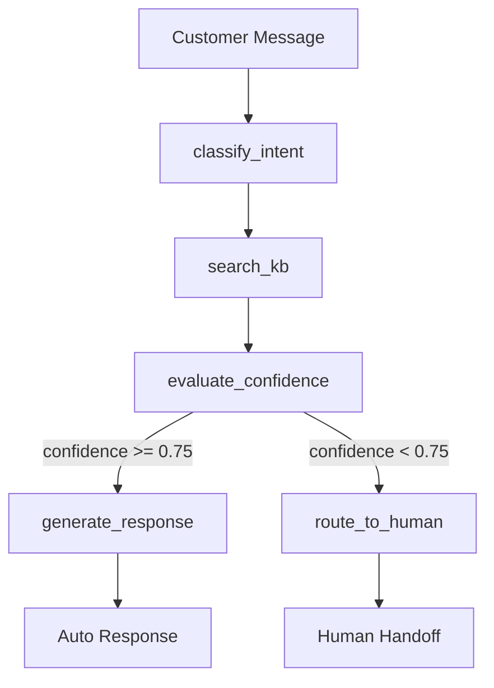

# AI Ticket Router

> AI-powered customer support ticket routing agent built with LangGraph, FastAPI, and ChromaDB

[](https://www.python.org)
[](https://fastapi.tiangolo.com)
[](https://langchain-ai.github.io/langgraph/)
[]()
[]()

**Live Demo:** [tickets.cognurix.com](https://tickets.cognurix.com)
**API Docs:** [tickets.cognurix.com/docs](https://tickets.cognurix.com/docs)

---

## Overview

An AI-powered customer support ticket routing agent that:
- **Classifies** incoming messages by intent, sentiment, and urgency
- **Searches** a knowledge base using semantic similarity (RAG)
- **Decides** whether to auto-respond or route to a human team
- **Generates** professional responses or structured handoff packets

---

## Architecture



### LangGraph Workflow

1. **classify_intent**: Classifies into 6 intents (billing, technical, shipping, general, complaint, refund) + sentiment + urgency
2. **search_kb**: Semantic search in ChromaDB with metadata filtering by intent
3. **evaluate_confidence**: Multi-stage evaluation of KB result quality
4. **[Decision Point]**: Route based on confidence threshold (0.75)
5. **generate_response**: Create auto-response using KB context
6. **route_to_human**: Generate structured handoff packet with team assignment

---

## Tech Stack

| Component | Technology | Purpose |
|-----------|-----------|---------|
| Agent Framework | LangGraph | Stateful multi-step workflows |
| API Layer | FastAPI | REST API with async support |
| Vector Database | ChromaDB | Semantic search |
| LLM | Groq (Llama 3.3 70B) | Intent classification & response generation |
| Embeddings | OpenAI text-embedding-3-small | Document and query embeddings |
| Database | SQLite | Ticket history & analytics |
| Deployment | Docker + Cloudflare Zero Trust | Containerized deployment |
| CI/CD | GitHub Actions | Automated testing on push |

---

## Project Structure

```
intelligent-ticket-router/
├── src/
│   ├── agent/
│   │   ├── graph.py              # LangGraph workflow assembly
│   │   ├── state.py              # TypedDict state definition
│   │   └── nodes/
│   │       ├── classify.py       # Intent classification
│   │       ├── search_kb.py      # Knowledge base search
│   │       ├── evaluate.py       # Confidence evaluation
│   │       ├── respond.py        # Auto-response generation
│   │       └── route.py          # Human routing
│   ├── rag/
│   │   ├── vectorstore.py        # ChromaDB operations
│   │   ├── embeddings.py         # OpenAI embedding generation
│   │   ├── chunker.py            # Document chunking
│   │   └── retriever.py          # Retrieval pipeline
│   ├── api/
│   │   ├── routes/
│   │   │   ├── tickets.py        # Ticket processing endpoints
│   │   │   ├── knowledge_base.py # KB management endpoints
│   │   │   └── health.py         # Health checks
│   │   └── models/
│   │       ├── requests.py       # Pydantic request models
│   │       └── responses.py      # Pydantic response models
│   ├── db/
│   │   ├── database.py           # Async SQLite session management
│   │   └── models.py             # SQLAlchemy models
│   ├── frontend/
│   │   └── index.html            # Single-page demo UI
│   ├── config.py                 # Settings (Pydantic BaseSettings)
│   └── main.py                   # FastAPI app entry point
├── tests/
│   ├── unit/                     # Unit tests with mocked LLM calls
│   └── integration/              # API and agent flow integration tests
├── data/seed/knowledge_base/     # Seed FAQ documents (markdown)
├── scripts/seed_kb.py            # KB seeding script
├── deploy/cloudflared.yml        # Cloudflare tunnel config template
├── Dockerfile
├── docker-compose.yml
├── Makefile
└── requirements.txt
```

---

## Quick Start

### Prerequisites

- Python 3.11+
- Docker and Docker Compose
- [Groq API key](https://console.groq.com/keys) (free tier)
- OpenAI API key (for embeddings)

### 1. Clone and Configure

```bash
git clone https://github.com/joonhkim/intelligent-ticket-router.git
cd intelligent-ticket-router

cp .env.example .env
# Edit .env and add your GROQ_API_KEY and OPENAI_API_KEY
```

### 2. Run with Docker

```bash
make build
make run
make seed-docker    # Load knowledge base documents

# App available at http://localhost:8000
# API docs at http://localhost:8000/docs
```

### 3. Or Run Locally

```bash
python3.11 -m venv .venv
source .venv/bin/activate
pip install -r requirements.txt

make seed           # Load knowledge base
make dev            # Start with hot reload
```

---

## API Usage

### Process a Ticket

```bash
curl -X POST "http://localhost:8000/api/v1/tickets/process" \
  -H "Content-Type: application/json" \
  -d '{
    "message": "I was charged twice for order #12345 and nobody is responding",
    "customer_id": "cust_abc123",
    "channel": "email"
  }'
```

**Response:**

```json
{
  "ticket_id": "tkt_6a100d264c57",
  "action": "route_to_human",
  "classification": {
    "intent": "billing",
    "sentiment": "angry",
    "urgency": "high"
  },
  "routing": {
    "team": "billing_team",
    "priority": "critical",
    "summary": "Customer reports duplicate charge on order #12345..."
  },
  "kb_confidence": 0.0,
  "processing_time_ms": 1370,
  "agent_trace": [
    "classify_intent: billing (sentiment: angry, urgency: high)",
    "search_kb: found 0 results, top score 0.000",
    "evaluate_confidence: 0.00 (no KB results, routing to human)",
    "route_to_human: billing_team, priority critical"
  ]
}
```

### Other Endpoints

```bash
GET  /health                           # Health check
GET  /api/v1/tickets/history           # Ticket history (paginated)
GET  /api/v1/knowledge-base/search?q=  # KB search
GET  /api/v1/knowledge-base/stats      # KB statistics
POST /api/v1/knowledge-base/ingest     # Upload documents
```

---

## Development

### Commands

```bash
make help           # Show all commands
make dev            # Run locally with hot reload
make test           # Run test suite (86 tests, 83% coverage)
make lint           # Run ruff linter
make build          # Build Docker images
make run            # Start Docker services
make logs           # Tail container logs
make seed           # Load seed documents
make clean          # Remove containers and volumes
make deploy         # Deploy to VPS via SSH
```

### Running Tests

```bash
make test

# Or with HTML coverage report
pytest tests/ --cov=src --cov-report=html
```

---

## Design Decisions

### Why LangGraph?
Stateful workflows with conditional routing, built-in checkpointing, and observability. Better than simple chains for multi-step agents with branching logic.

### Why ChromaDB?
Lightweight, embeddable vector database. No managed service needed — perfect for VPS deployment. Handles the scale needed for a support knowledge base.

### Why SQLite?
Zero configuration, single-file database. Sufficient for moderate ticket volumes on a single server. Easy to migrate to Postgres if needed later.

### Why Groq?
Not to be confused with Grok with 'k', Groq provides free tier with generous rate limits (30 RPM). Llama 3.3 70B provides strong classification and generation quality. Fast inference speeds (~500ms per request).

---

## Author

**Joon Kim** — Full-Stack Engineer → AI Engineer

[LinkedIn](https://www.linkedin.com/in/jkim789) | [Portfolio](https://cognurix.com)

*6+ years at Wayfair building omni-channel customer service platforms, 1+ year at Microsoft as AKS Support Engineer.*

---

## License

MIT License
